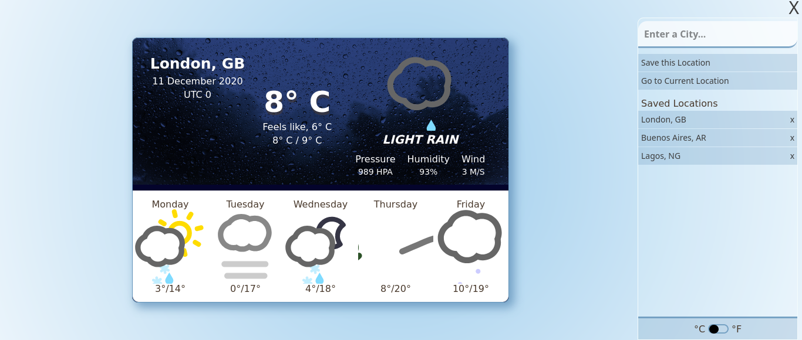

# Whetha

> A weather web app that displays the current weather for a given location, using the OpenWeatherMap API.



## MVP Functionality

- Enable your current location
- Search for weather by city name
- Toggle between Celsius and Fahrenheit
- Toggle menu
- See a different background based on the location's weather

## :tv: Media

[Live Demo Link](https://whetha.netlify.app/)

## :toolbox: Tools & Technologies Used

### Built with

- HTML5
- CSS3
- JavaScript ES6
- webpack 5

## :rocket: Getting Started

To get a local copy up and running follow these simple example steps.

### Prerequisites

Install [Node.js with npm](https://nodejs.org/en/download/)

Install [webpack](https://webpack.js.org/guides/getting-started/)

### Set up

Clone repo into your local environment:

Clone with SSH

```git
git clone git@github.com:cliftondavies/Weather-App.git
```

Clone with HTTPS

```git
git clone https://github.com/cliftondavies/Weather-App.git
```

Open project directory

```bash
cd [your-directory-name]
```

Install packages:

```javascript
npm install
```

### Local Usage

#### In console

Start webpack:

```javascript
npm run watch
```

#### In Browser

Visit `http://localhost:3000/`.

## Author

👤 **Clifton Davies**

- Github: [@githubhandle](https://github.com/cliftondavies)
- Twitter: [@twitterhandle](https://twitter.com/cliftonaedavies)
- Linkedin: [linkedin](https://www.linkedin.com/in/clifton-davies-mbcs/)

## 🤝 Contributing

Contributions, issues and feature requests are welcome!

## Show your support

Give a ⭐️ if you like this project!

## Acknowledgements

- [Picular](https://picular.co/)
- [ConvertingColors](https://convertingcolors.com/)
- [HTML-CSS-JS](https://html-css-js.com/css/generator/box-shadow/)
- [Joy Stamp](https://unsplash.com/s/photos/rainy?utm_source=unsplash&amp;utm_medium=referral&amp;utm_content=creditCopyText)
- [Cloris Ying](https://unsplash.com/s/photos/snowy?utm_source=unsplash&amp;utm_medium=referral&amp;utm_content=creditCopyText)
- [Marc Wieland](https://unsplash.com/s/photos/cloudy?utm_source=unsplash&amp;utm_medium=referral&amp;utm_content=creditCopyText)
- [Dave Hoefler](https://unsplash.com/s/photos/foggy?utm_source=unsplash&amp;utm_medium=referral&amp;utm_content=creditCopyText)

## 📝 Copyright & License

Copyright (c) 2020 Clifton Davies.
This project is licensed under [MIT](https://opensource.org/licenses/MIT). See LICENSE file for details.
